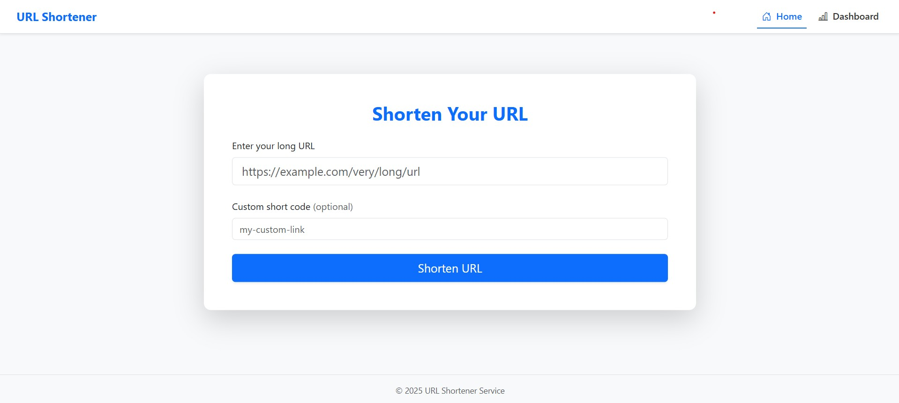
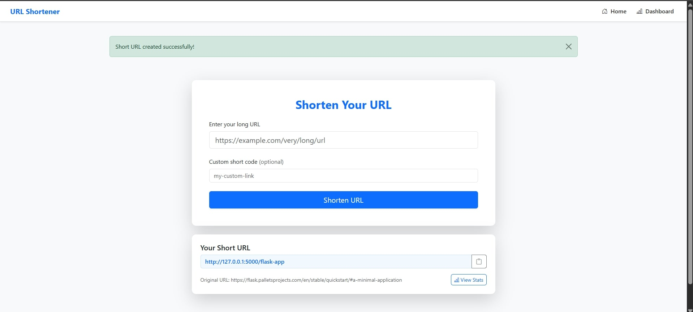
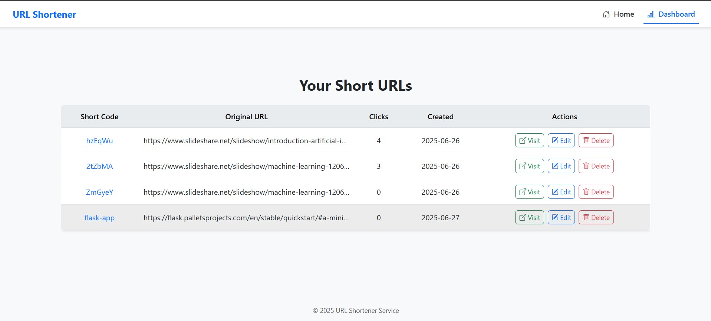
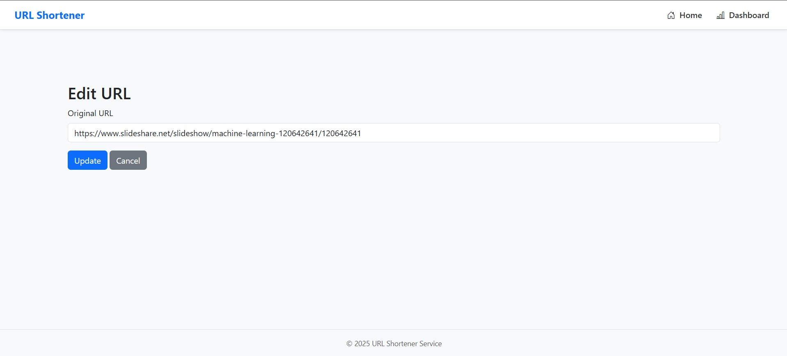

# URL Shortener Service  

Project URL: https://roadmap.sh/projects/url-shortening-service  
A simple URL shortening service built with Flask and MongoDB. Offers a RESTful API to create, manage, and track short URLs, along with a minimalist Bootstrap-powered frontend. 
Perfect for learning backend APIs, database integration, and frontend templating with Flask. 
Includes click statistics, custom short codes, and a clean responsive UI.

---

## Features

- **Shorten long URLs** into simple, shareable links
- Optional **custom short codes**
- Track **click statistics** and creation/update timestamps
- Full **RESTful API** support
- Beautiful, responsive **Bootstrap 5 UI**
- Configuration via `.env` file
- MongoDB backend with `Flask-PyMongo`
- Short code generation via `shortuuid`

---

## Tech Stack

| Layer     | Technology            |
|-----------|------------------------|
| Backend   | Python (Flask)         |
| Database  | MongoDB                |
| Frontend  | HTML, CSS, Bootstrap 5 |
| Tools     | Flask-PyMongo, shortuuid, python-dotenv |

---

## Installation

### Prerequisites

- Python 3.7+
- MongoDB installed (or use MongoDB Atlas)
- Git & pip

### Setup Steps

1. **Clone the repository:**

```bash
git clone https://github.com/lalitaditya04/url_shortener.git
cd url_shortener
```

2. **Create and activate a virtual environment:**

```bash
python -m venv venv
# On Windows:
venv\Scripts\activate
# On macOS/Linux:
source venv/bin/activate
```

3. **Install dependencies:**

```bash
pip install -r requirements.txt
```

4. **Set up environment variables:**

   Rename the `.env.example` file to `.env` and add your configuration:

```env
SECRET_KEY=your-secret-key
MONGO_URI=mongodb://localhost:27017/url_shortener
BASE_URL=http://localhost:5000
```

5. **Run the application:**

```bash
python run.py
```

6. **Visit the app:**

   Open your browser and go to: http://localhost:5000

---

## RESTful API Reference

All endpoints follow REST conventions and return JSON.

### POST /shorten — Create short URL

```json
{
  "url": "https://example.com/very/long/url",
  "short_code": "custom-code"
}
```

**Response:**
```json
{
  "url": "https://example.com/very/long/url",
  "short_code": "abc123",
  "short_url": "http://localhost:5000/abc123"
}
```

### 🔹 GET /shorten/<short_code> — Retrieve original URL

Returns HTTP 302 redirect to the original URL.

### 🔹 PUT /shorten/<short_code> — Update existing short URL

```json
{
  "url": "https://example.com/updated-url"
}
```

### 🔹 DELETE /shorten/<short_code> — Delete a short URL

Deletes the short code and its mappings.

### 🔹 GET /shorten/<short_code>/stats — Get stats

```json
{
  "url": "https://example.com/very/long/url",
  "short_code": "abc123",
  "created_at": "2025-06-25T12:00:00Z",
  "updated_at": "2025-06-25T12:30:00Z",
  "access_count": 12
}
```

---

## 📁 Project Structure

```
url_shortener/
│
├── app/
│   ├── __init__.py          # Flask app factory
│   ├── models.py            # MongoDB models & DB logic
│   ├── utils.py             # Short code generation, validation
│   ├── extensions.py        # Mongo client setup
│   ├── config.py            # App config via dotenv
│   ├── routes/
│   │   ├── views.py         # HTML-rendered routes
│   │   └── api.py           # REST API routes
│   ├── static/
│   │   ├── css/style.css
│   │   └── js/main.js
│   └── templates/
│       ├── base.html
│       ├── index.html
│       ├── dashboard.html
│       ├── edit.html
│       └── 404.html
│
├── .env                     # Your environment variables (not tracked in git)
├── .env.example             # Template for .env
├── run.py                   # Entry point
├── requirements.txt         # Python dependencies
└── README.md                # This file
```

---

**Important:** Ensure `.env` is in the root directory and not committed to Git.

---

## 📸 Screenshots

### Home Page


### URL Creation Page


### Dashboard


### Editing URL Page

---

**Happy shortening! 🚀**